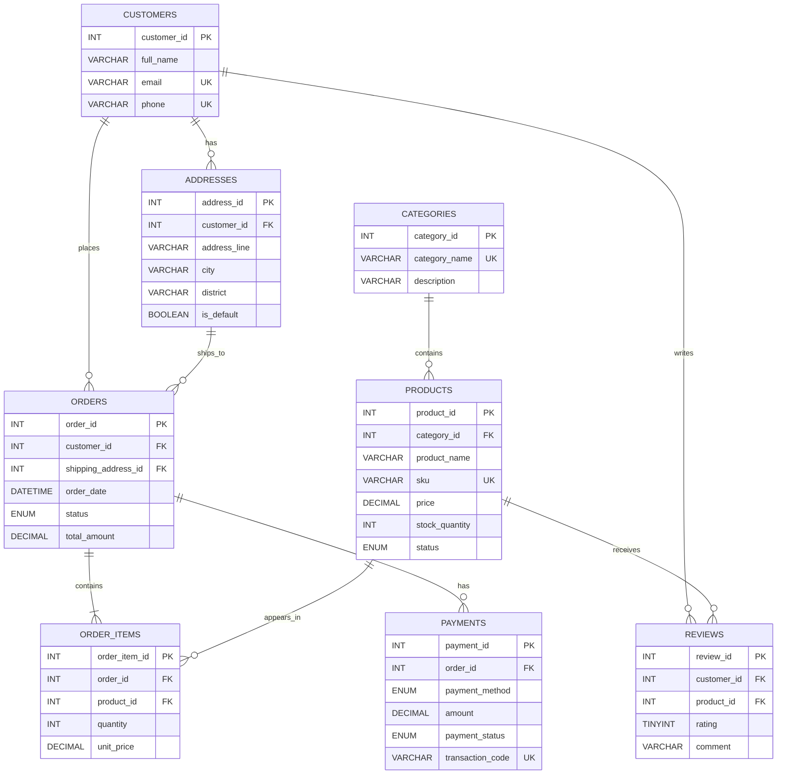

```mermaid
erDiagram
    CATEGORIES ||--o{ PRODUCTS : contains
    CUSTOMERS ||--o{ ADDRESSES : has
    CUSTOMERS ||--o{ ORDERS : places
    ADDRESSES ||--o{ ORDERS : ships_to
    ORDERS ||--|{ ORDER_ITEMS : contains
    PRODUCTS ||--o{ ORDER_ITEMS : appears_in
    ORDERS ||--o{ PAYMENTS : has
    CUSTOMERS ||--o{ REVIEWS : writes
    PRODUCTS ||--o{ REVIEWS : receives

    CATEGORIES {
      INT category_id PK
      VARCHAR category_name UK
      VARCHAR description
    }
    PRODUCTS {
      INT product_id PK
      INT category_id FK
      VARCHAR product_name
      VARCHAR sku UK
      DECIMAL price
      INT stock_quantity
      ENUM status
    }
    CUSTOMERS {
      INT customer_id PK
      VARCHAR full_name
      VARCHAR email UK
      VARCHAR phone UK
    }
    ADDRESSES {
      INT address_id PK
      INT customer_id FK
      VARCHAR address_line
      VARCHAR city
      VARCHAR district
      BOOLEAN is_default
    }
    ORDERS {
      INT order_id PK
      INT customer_id FK
      INT shipping_address_id FK
      DATETIME order_date
      ENUM status
      DECIMAL total_amount
    }
    ORDER_ITEMS {
      INT order_item_id PK
      INT order_id FK
      INT product_id FK
      INT quantity
      DECIMAL unit_price
    }
    PAYMENTS {
      INT payment_id PK
      INT order_id FK
      ENUM payment_method
      DECIMAL amount
      ENUM payment_status
      VARCHAR transaction_code UK
    }
    REVIEWS {
      INT review_id PK
      INT customer_id FK
      INT product_id FK
      TINYINT rating
      VARCHAR comment
    }
```
